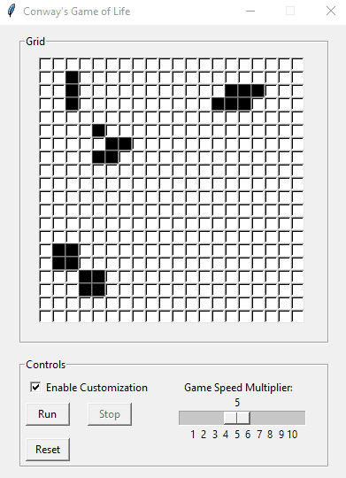

# Conway's Game of Life

## Dependencies:
- `tkinter`

## How to use:
Type in `python3 Conway.py` into the terminal.

## Interface:
- Play
- Pause
- Enable Customization (lets the user edit the current 'generation')
- Game Speed Slider (1/sec to 10/sec)
- The `Presets` menu bar option allows for different presents, so the user does not have to make it by hand.
- The `Size` menu bar option resizes the entire gui for 20x20, 30x30, and 40x40 grids.

## Examples:
### Beacon, Blinker, Glider, & Toad:

### Heavy-weight spaceship:

## 40x40 Grid:

